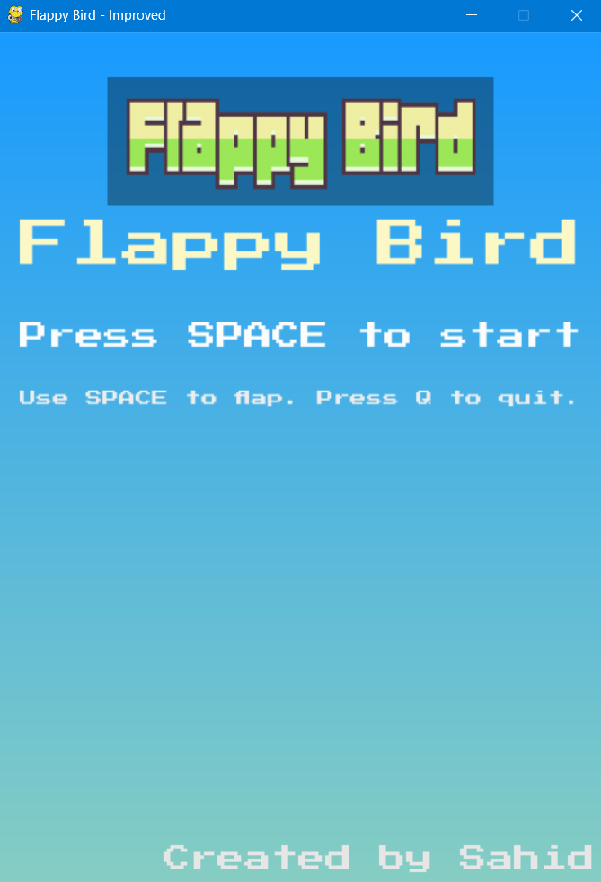

# Flappy Bird Game

A small, polished Flappy Bird clone built with Python and pygame.
This repository contains a lightweight, well-documented example game intended for learning, packaging, and distribution.

---

## Project overview

- Language: Python 3
- Library: pygame
- Purpose: Educational game demonstrating simple game loop architecture, asset management, sound, and input handling.

---

## Screenshot / Demo

The repository already contains a screenshot file in `assets/`:

- `assets/Screenshot 2025-08-29 234103.png`

You can preview it in the README via the link below. 




---

## Requirements

- Python 3.8 or newer
- pygame (see `requirements.txt`)

---

## Install

Create a virtual environment (recommended) and install dependencies:

```powershell
python -m venv .venv
.\.venv\Scripts\Activate.ps1
pip install -r requirements.txt
```

---

## Run

Start the game from the repository root:

```powershell
python main.py
# or
python flappy.py
```

Controls

- SPACE: flap / jump
- Q or window close: quit

---

## Project layout

- `flappy.py` - Main game implementation (game loop, rendering, input).
- `main.py` - Canonical entry point that runs `flappy.main()`.
- `assets/` - Images, sounds, font, and highscore file (canonical asset location).
- `requirements.txt` - Project dependencies.
- `LICENSE` - MIT license.
- `README.md` - This file.

---
## Contributing

Contributions are welcome. Typical workflow:

1. Fork the repository
2. Create a feature branch
3. Implement changes and add tests where feasible
4. Submit a pull request with a clear description of your changes

---

## Packaging / Distribution

For single-file distribution on Windows, you can use PyInstaller. Example (run after activating your virtualenv):

```powershell
pip install pyinstaller
pyinstaller --onefile --windowed main.py
```

Note: include the `assets/` directory when packaging the executable.

---

## License

This project is licensed under the MIT License. See `LICENSE` for details.
